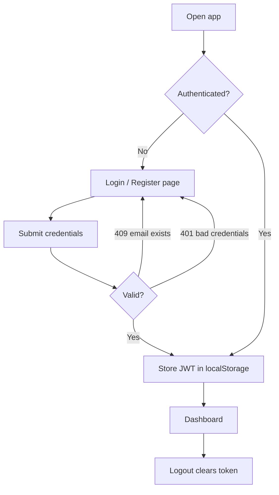
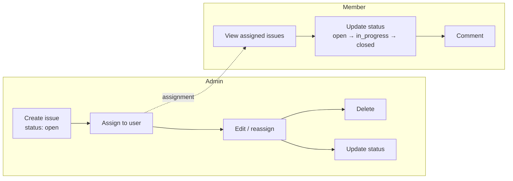
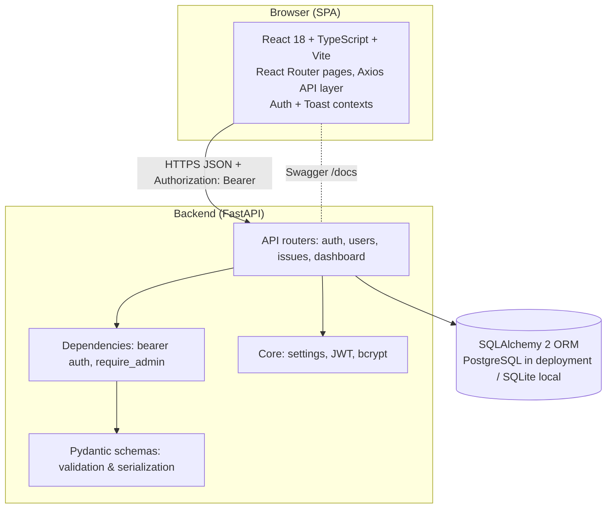
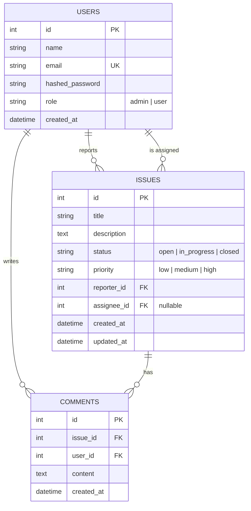

# Business Requirements Document (BRD)

## Issue Tracker System

| Field | Value |
| --- | --- |
| Document title | Business Requirements Document — Issue Tracker System |
| Version | 1.0 |
| Date | 2 October 2026 |
| Status | Delivered (development test project) |
| Repository | `joswintauro28/Issue-Tracker-ETS-` (branch `dev`) |
| Live frontend | <https://issue-tracker-ets.vercel.app> |
| Live backend | <https://issue-tracker-ets.onrender.com> |

---

## 1. Introduction

### 1.1 Purpose

This document specifies the business requirements for the **Issue Tracker System**, a full-stack web application that allows a team to register users, track work items (issues) through a defined lifecycle, assign work to team members, hold discussions on each item via comments, and monitor progress through a dashboard. The system was built and delivered as a 5-hour development test.

### 1.2 Background

The organization needs a lightweight, self-hosted tool to log issues, assign them to owners, and track their resolution status. Spreadsheet-based tracking lacks workflow enforcement, access control, and real-time aggregation, so a dedicated application with authenticated users and role-based permissions was requested.

### 1.3 Definitions

| Term | Definition |
| --- | --- |
| Issue | A work item with a title, description, status, priority, reporter and optional assignee |
| Status workflow | `open` → `in_progress` → `closed` |
| Admin | User with the `admin` role; full control over issues and assignment |
| User (member) | User with the `user` role; works on issues assigned to them |
| JWT | JSON Web Token used for stateless authentication (HS256) |

## 2. Business Objectives

| ID | Objective | How the delivered system addresses it |
| --- | --- | --- |
| BO-1 | Centralize issue tracking in one tool | Single deployed web app with persistent PostgreSQL storage |
| BO-2 | Make ownership explicit | Issues carry a reporter (server-assigned) and an assignable owner |
| BO-3 | Provide visibility into progress | Dashboard with live counters per status plus recent/assigned issue lists |
| BO-4 | Protect data with authentication and permissions | JWT login; backend-enforced RBAC on every endpoint |
| BO-5 | Deliver maintainable, tested software | Layered FastAPI architecture, typed React frontend, 73 passing pytest tests |

## 3. Project Scope and Exclusions

### 3.1 In Scope

- User registration and login (JWT sessions).
- Issue CRUD: create, edit, delete (admin); view (all authenticated users within RBAC scope).
- Assignment of issues to registered users (admin only), including unassignment.
- Status tracking with three states: **Open**, **In Progress**, **Closed**.
- Priority classification: low / medium / high.
- Comments on issues (chronological).
- Dashboard with aggregate counts and lists.
- Issue list with pagination, status/assignee filters and text search.
- Role-based access control (`admin` / `user`) enforced in the backend.
- Idempotent admin seeding from configuration.
- Automated backend test suite; frontend typecheck/production build.
- Deployment of frontend and backend with documentation.

### 3.2 Exclusions (not in this release)

- Email notifications, password reset, email verification, OAuth/SSO.
- Refresh tokens / single-sign-on session sharing.
- File attachments, image uploads, @mentions.
- Comment editing/deletion and comment pagination.
- Custom workflows, issue types beyond priority, sub-issues, milestones, sprints.
- User management UI (role changes, user deactivation).
- Rate limiting, audit logging, admin analytics beyond the dashboard.
- Native mobile applications and offline support.
- Alembic-based schema migrations and automated backup/CI pipelines.

## 4. Stakeholders

| Stakeholder | Role | Interest |
| --- | --- | --- |
| Development test evaluator | Reviewer | Assesses the delivered test project against requirements |
| Administrators | Primary operators | Create, edit, assign, delete issues; monitor the dashboard |
| Team members (users) | Day-to-day users | View and update status of their assigned issues; comment |
| Development team | Builders/maintainers | Repository ownership, deployment, future iterations |

## 5. Functional Requirements

### 5.1 Authentication

| ID | Requirement | Status |
| --- | --- | --- |
| FR-A1 | A visitor can register with name, email, password and password confirmation (password ≥ 8 chars; mismatch → validation error) | ✅ Implemented |
| FR-A2 | Registration of an existing email returns `409 Conflict` | ✅ Implemented |
| FR-A3 | A registered user can log in with email + password and receives a JWT access token | ✅ Implemented |
| FR-A4 | Invalid credentials return `401 Unauthorized` | ✅ Implemented |
| FR-A5 | The authenticated user can retrieve their own profile (`GET /api/auth/me`) | ✅ Implemented |
| FR-A6 | Self-registered accounts receive the `user` role; the first admin is bootstrapped by the seeder | ✅ Implemented |
| FR-A7 | Expired or malformed tokens are rejected with `401` and a clear message | ✅ Implemented |

### 5.2 Issue Management

| ID | Requirement | Status |
| --- | --- | --- |
| FR-I1 | Admin can create an issue with title, description, priority and optional assignee; reporter is set server-side (`201`) | ✅ Implemented |
| FR-I2 | Admin can edit an issue (full replacement via `PUT`, partial via `PATCH`) | ✅ Implemented |
| FR-I3 | Admin can delete an issue; comments cascade-delete (`204`) | ✅ Implemented |
| FR-I4 | Any authenticated user can view issue details — admin: all issues; user: only issues assigned to them (otherwise `403`) | ✅ Implemented |
| FR-I5 | Issues support status values `open`, `in_progress`, `closed` (default `open`) | ✅ Implemented |
| FR-I6 | Admin can update any issue's status; a user can update the status of issues assigned to them; anyone else gets `403` | ✅ Implemented |
| FR-I7 | Admin can assign an issue to any registered user or unassign with `null`; nonexistent assignee → `400` | ✅ Implemented |
| FR-I8 | Users can never create, edit, delete or assign issues (API returns `403`) | ✅ Implemented |
| FR-I9 | Issue list supports pagination (`page`, `page_size` ≤ 100), filters (`status`, `assignee_id`, `unassigned`) and case-insensitive `search` over title/description | ✅ Implemented |
| FR-I10 | Regular users receive only their assigned issues in list and dashboard queries | ✅ Implemented |

### 5.3 Comments

| ID | Requirement | Status |
| --- | --- | --- |
| FR-C1 | Authenticated users can add a comment to an issue they can view (`201`; blank content rejected) | ✅ Implemented |
| FR-C2 | Comments are returned in chronological order and display their author | ✅ Implemented |
| FR-C3 | Users may comment only on issues assigned to them; admins on any issue | ✅ Implemented |

### 5.4 Dashboard

| ID | Requirement | Status |
| --- | --- | --- |
| FR-D1 | The dashboard shows total, open, in-progress and closed counts computed live from the database | ✅ Implemented |
| FR-D2 | The dashboard lists the 5 most recent issues within the caller's scope | ✅ Implemented |
| FR-D3 | The dashboard lists up to 5 of the caller's non-closed assigned issues, most recently updated first | ✅ Implemented |
| FR-D4 | Scope follows RBAC: admins see the whole project, users see only their assigned work | ✅ Implemented |

### 5.5 User Directory & Seeding

| ID | Requirement | Status |
| --- | --- | --- |
| FR-U1 | Admin can list all users (assignment picker) via `GET /api/users`; users get `403` | ✅ Implemented |
| FR-S1 | An idempotent seed script creates the admin account from `ADMIN_*` environment variables (bcrypt-hashed, never printed; ≥ 8 chars) | ✅ Implemented |
| FR-S2 | Running the seed script repeatedly never duplicates data; unset admin config → skipped with a warning | ✅ Implemented |
| FR-S3 | Optional `--demo` flag seeds local demo users/issues (not for production) | ✅ Implemented |

## 6. Non-Functional Requirements

| ID | Requirement | Approach in the delivered system |
| --- | --- | --- |
| NFR-1 | Security | bcrypt password hashing (72-byte limit), JWT HS256 with configurable expiry (default 24 h), no secrets in source (env/gitignored `.env`), CORS restricted to exact configured origins |
| NFR-2 | Authorization integrity | RBAC checks at the API boundary (`require_admin` dependency + per-route scoping); UI hiding is never the only barrier |
| NFR-3 | Performance | Lightweight single-page frontend; dashboard counts from a single `GROUP BY`; paginated issue list (max 100/page); indexed foreign keys and status column |
| NFR-4 | Reliability | Health endpoint `/api/health`; per-request DB sessions with `pool_pre_ping`; idempotent seeding; 73 automated tests |
| NFR-5 | Portability | SQLite for zero-config local dev, PostgreSQL for deployment via `DATABASE_URL` |
| NFR-6 | Usability | Tailwind UI with toasts, confirm dialogs, loading spinners, clear error messages, responsive sidebar layout |
| NFR-7 | Maintainability | Layered backend (routes / schemas / models / core), typed frontend (strict TypeScript, `tsc --noEmit` in build), documented API via OpenAPI/Swagger |
| NFR-8 | Compatibility | Modern browsers evergreen (ES modules via Vite build); SPA deep links handled by hosting rewrite |

## 7. User Workflows

### 7.1 Registration and login

### 7.2 Issue lifecycle (admin vs. member)

### 7.3 Dashboard review

1. User logs in → dashboard requests `GET /api/dashboard/summary`.
2. Backend computes counts for the caller's scope (all issues for admin, assigned issues for member).
3. UI renders counters, the 5 most recent issues, and the caller's actionable assigned issues; each row links to issue details.

## 8. System Architecture

Key decisions:

- **Stateless auth** (JWT) — no server session store.
- **Sync SQLAlchemy sessions** with per-request dependency injection.
- **CORS middleware** with an exact-origin allowlist from configuration.
- **Schema bootstrap** via `create_all()` at startup (plus idempotent legacy-role normalization); Alembic is a future item.
- **Frontend/dev parity** — Vite proxies `/api` to `localhost:8000` in development, so the same relative API paths work locally and in production.

## 9. Database Requirements

### 9.1 Entity-relationship diagram

### 9.2 Rules and constraints

| Requirement | Implementation |
| --- | --- |
| Unique user email | `users.email` unique index; duplicate registration → `409` |
| Referential integrity | `reporter_id`/`issue_id`/`user_id` foreign keys; issue delete cascades comments; assignee delete sets `NULL` (`ON DELETE SET NULL`) |
| Status/priority integrity | Database-level enums (string columns with validated values, `status` indexed) |
| Audit timestamps | Server-side `created_at`/`updated_at` (`updated_at` auto-refreshes on update) |
| Referential scope | Non-admin queries filtered by `assignee_id` |
| Portability | Works on SQLite and PostgreSQL (enum stored as name/value-agnostic string) |

## 10. Security Requirements

| ID | Requirement | Implementation |
| --- | --- | --- |
| SR-1 | Passwords must never be stored or returned in plaintext | bcrypt hashes; `UserRead` schema omits `hashed_password` |
| SR-2 | All mutating endpoints require authentication | `HTTPBearer` dependency on every router; missing/invalid token → `401` |
| SR-3 | Privileged operations restricted to admins | `require_admin` dependency → `403` with a readable message |
| SR-4 | Members must not access unrelated data | Per-route scoping (`_ensure_can_view`, scoped list/dashboard queries) |
| SR-5 | Tokens must expire | Configurable expiry (default 1440 minutes); expired signature → `401` |
| SR-6 | No secrets in source control | `.env` gitignored; `.env.example` holds placeholders only; random `SECRET_KEY` fallback with a startup warning |
| SR-7 | Cross-origin access restricted | CORS allowlist from `CORS_ORIGINS` (exact origins, no wildcards) |
| SR-8 | Client-side session hygiene | Frontend clears stored token and redirects to login on `401` |

## 11. Deployment

### 11.1 Hosting providers and services (actual)

| Component | Provider | Details |
| --- | --- | --- |
| Frontend SPA | **Vercel** | Static build of `frontend/` (`npm run build` → `dist/`); SPA rewrite committed in `frontend/vercel.json` (`/(.*)` → `/`); build-time env var `VITE_API_URL=https://issue-tracker-ets.onrender.com/api` |
| Backend API | **Render** | Web service built from `backend/`; build `pip install -r requirements.txt`; start `python seed.py && uvicorn app.main:app --host 0.0.0.0 --port $PORT`; env vars `DATABASE_URL`, `SECRET_KEY`, `CORS_ORIGINS`, `ADMIN_*` |
| Source control | **GitHub** | `joswintauro28/Issue-Tracker-ETS-`, working branch `dev` |
| Database | PostgreSQL | Connection string supplied via `DATABASE_URL` (SQLAlchemy form `postgresql+psycopg://...?sslmode=require`) |
| Live URLs | — | Frontend: <https://issue-tracker-ets.vercel.app> · Backend: <https://issue-tracker-ets.onrender.com> |

### 11.2 Deployment approach and configuration

- **Environment:** frontend and backend are deployed as separate services; the SPA calls the API over HTTPS with CORS restricted to the exact Vercel origin.
- **Configuration:** all runtime configuration is environment variables on the hosting dashboards; no secrets are stored in the repository.
- **Admin bootstrap:** the backend start command runs `seed.py` first, so the admin account is created (idempotently) on every deploy.
- **Build-time coupling:** `VITE_API_URL` is inlined by Vite at build time — changing it requires a frontend rebuild.

### 11.3 Steps to deploy or update the application

1. Push commits to the `dev` branch on GitHub.
2. **Backend (Render):** trigger a redeploy (manual "Deploy latest commit" or enabled auto-deploy). After changing environment variables, restart the service. Startup runs migrations-by-`create_all`, seeds the admin, then serves on `$PORT`.
3. **Frontend (Vercel):** create a new deployment ("Redeploy"). If `VITE_API_URL` changed, ensure it is saved before rebuilding (value must end with `/api`).
4. **Verify:** `GET /api/health` returns `{"status":"ok"}`; load the frontend URL and complete a register/login round-trip. If an old bundle is cached by the CDN, hard-refresh the browser.

### 11.4 Database migration and backup approach

- **Migrations:** none in this release. The schema is created at startup with `Base.metadata.create_all()` plus an idempotent legacy-role fix (`MEMBER` → `USER`). Before evolving the live schema, adopt **Alembic** (`alembic revision` → `alembic upgrade head` in the deploy step).
- **Backups:** no automated backup pipeline is configured in this repository. Recommended approach: enable the database provider's automated backups and/or schedule `pg_dump $DATABASE_URL > backup.sql`. SQLite development files are disposable and gitignored.

## 12. Testing Strategy

| Level | Tooling | Scope |
| --- | --- | --- |
| Backend unit/integration | pytest + FastAPI `TestClient` (httpx) | 73 tests across auth (19), issues/comments (30), RBAC (13), dashboard (5), seeding (6); runs against an isolated SQLite file created and deleted per run |
| Frontend static verification | `tsc --noEmit` (run as part of `npm run build`) | Type safety of the entire React codebase |
| Frontend production build | `vite build` | Ensures the deployable bundle compiles |
| Manual end-to-end | Browser against local or deployed stack | Register/login, issue lifecycle, assignment, comments, dashboard, RBAC denials |

**Commands:** `python -m pytest tests -q` (backend, from `backend/`), `npm run build` (frontend, from `frontend/`). Current status: **73 passed**.

Quality gates before release: all backend tests green, frontend typecheck/build green, and a manual smoke test of login + issue flow on the deployed URLs.

## 13. Acceptance Criteria

| ID | Criterion | Verification |
| --- | --- | --- |
| AC-1 | A new visitor can register and then log in on the deployed app | FR-A1–A3; manual E2E on the live URLs |
| AC-2 | An admin can create, edit and delete an issue | FR-I1–I3; `test_issues.py` |
| AC-3 | An admin can assign an issue to a registered user (and unassign) | FR-I7; `test_issues.py` |
| AC-4 | Issues track status as Open / In Progress / Closed, and status updates are permission-checked | FR-I5–I6; `test_rbac.py` |
| AC-5 | Users can comment on issues and see comments chronologically with authors | FR-C1–C3; `test_issues.py` |
| AC-6 | The dashboard displays accurate counts that change with issue operations | FR-D1–D4; `test_dashboard.py` |
| AC-7 | Non-admins cannot create/edit/delete/assign or list users (API returns `403`) | FR-I8, FR-U1; `test_rbac.py` |
| AC-8 | The test suite passes (`73 passed`) and the frontend builds (`npm run build`) | Reproducible via documented commands |
| AC-9 | The application is deployed with live frontend and backend URLs documented in the README | Section 11.1 of this BRD; README "Live deployment" |
| AC-10 | No secrets are committed; deployment configuration is documented | `.gitignore`, `.env.example`, README deployment section |

## 14. Limitations

- No Alembic migrations — schema changes rely on `create_all()` and are not yet safely evolvable on a live database.
- No automated backups or CI/CD pipeline; tests run locally.
- No password reset, email delivery, refresh tokens or rate limiting.
- Comments are append-only (no edit/delete) and unpaginated.
- No user-management UI; roles change only through seeding or direct database changes.
- Tokens are kept in `localStorage` (XSS exposure) rather than HTTP-only cookies.
- The free backend instance sleeps when idle, causing a slow first request.
- The Users page is read-only; search covers title/description only (not comments).

---

*This document reflects the system as actually implemented in the repository. See [README.md](README.md) for setup, API reference and deployment instructions.*
